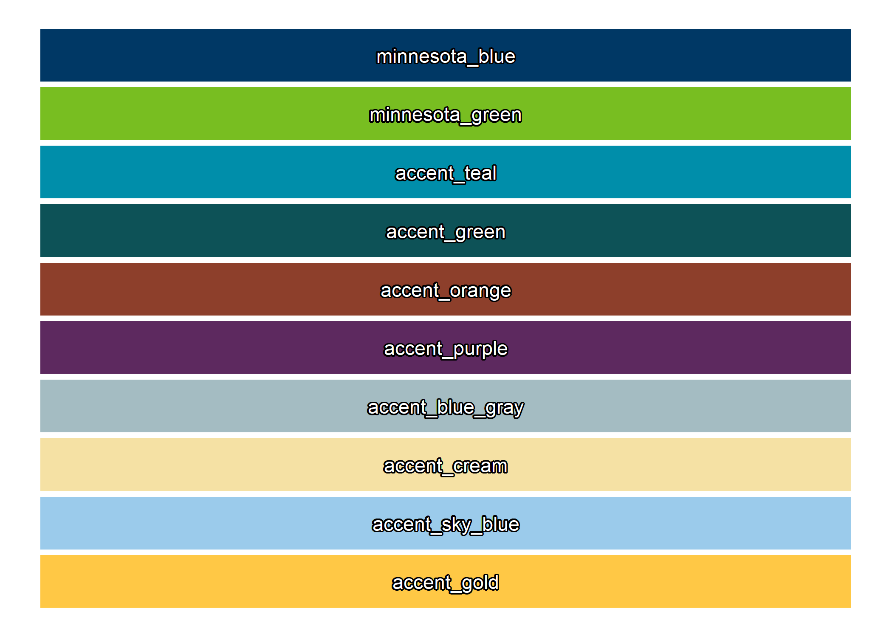
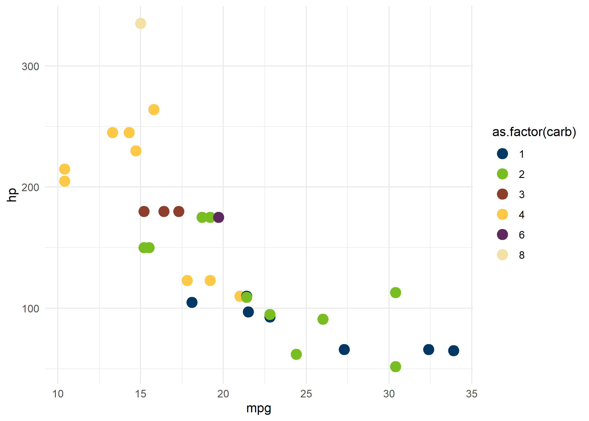

<!-- README.md is generated from README.Rmd. Please edit that file -->

# mnbrand

<!-- badges: start -->
<!-- badges: end -->

The goal of **mnbrand** is to make it easier to implement the [official
State of Minnesota color
palette](https://mn.gov/portal/brand/style-guide/colors/) in ggplot2.
Future versions of this package will include other functions/templates
to implement the State of Minnesota branding in reports and other data
products.

## Installation

You can install the development version of mnbrand from
[GitHub](https://github.com/) with:

``` r
# install.packages("devtools")
devtools::install_github("jfangmeier/mnbrand")
```

## Available Colors

The full list of brand colors is available with the `show_palette_mn`
function.

``` r
library(mnbrand)

show_palette_mn()
```



## Plot Examples

The mnbrand package can apply discrete palette colors (up to 10 colors)
and continuous palette colors in ggplot2, depending on the variables
being plotted. Here is an example using discrete colors with the
`scale_color_mn_d` function:

``` r
library(ggplot2)

mtcars %>%
  ggplot(aes(x = mpg, y = hp, color = as.factor(carb))) +
  geom_point(size = 4) +
  scale_color_mn_d() +
  theme_minimal()
```



When plotting with continuous variables, you can specify whether the
continuous palette should be diverting and what value should be used as
the diverging point. You can also specify which colors to use for
continuous palettes. Here is an example without diverging with the
`scale_fill_mn_c` function:

``` r
library(tigris)
#> To enable 
#> caching of data, set `options(tigris_use_cache = TRUE)` in your R script or .Rprofile.
library(dplyr)
#> 
#> Attaching package: 'dplyr'
#> The following objects are masked from 'package:stats':
#> 
#>     filter, lag
#> The following objects are masked from 'package:base':
#> 
#>     intersect, setdiff, setequal, union

# download county boundaries with tigris package
mn_counties <- counties(state = "MN", progress_bar = FALSE)

# calculate share of area covered by water
mn_counties_pct_water <- 
  mn_counties %>% 
  transmute(WATER = AWATER / (AWATER + ALAND))

mn_counties_pct_water %>% 
  ggplot(aes(fill = WATER)) +
  geom_sf() +
  scale_fill_mn_c() +
  theme_minimal() +
  labs(title = "Share of County Covered by Water")
```


Here is an example with diverging colors with a specified diverging
point and colors:

``` r
mn_counties_pct_water %>% 
  ggplot(aes(fill = WATER)) +
  geom_sf() +
  scale_fill_mn_c(
    diverge = TRUE,
    high_color = "minnesota_blue",
    low_color = "accent_orange",
    midpoint = 0.2
  ) +
  theme_minimal() +
  labs(title = "Share of County Covered by Water")
```


